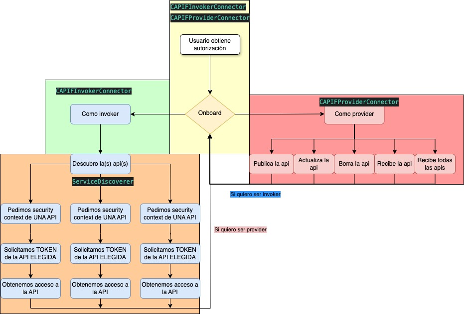
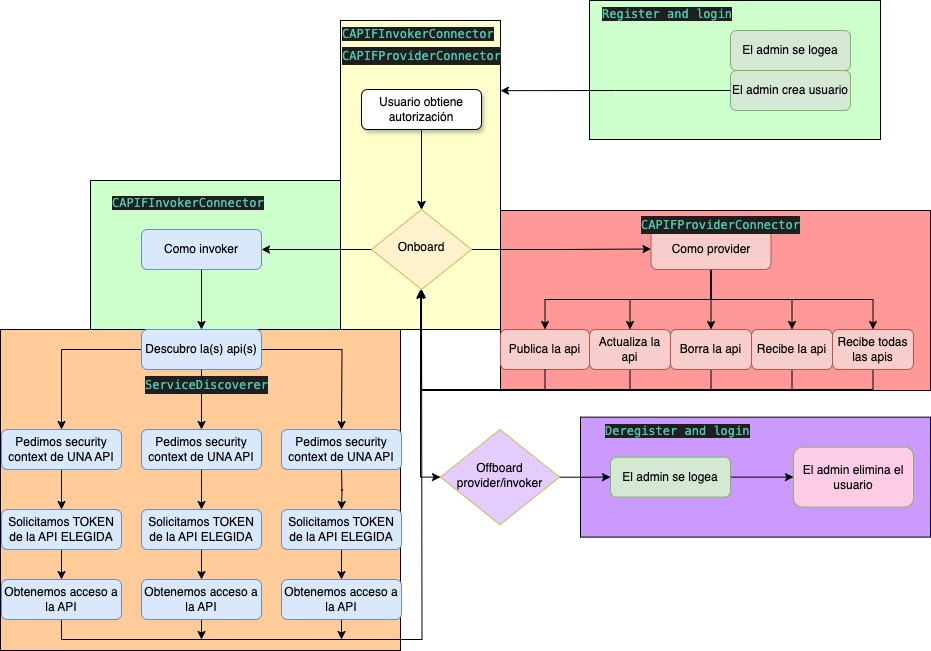

# SDK-S6G

This tool is focused on connect to CAPIF in a simpler way.

# Functionalities

- **Invoker Capif connector**: Simplifies the process of onboarding for Invoker users
  
- **Provider Capif connector**: Simplifies the process of onboarding for Provider users,also has the capability to register several APF's and AEF's if its necesary.
  
- **Invoker Service Discovery**: Facilitates making a Discovery request to CAPIF, also stores the API services recieved and has an option to filter them.
  
- **Invoker Service Get token**: After the Discovery, this functionality simplifies the way of getting created their propperly security context for each of the services and adquiring the access token to use the final API's 
  
- **Provider Publish Api**: Simplifies the process of publishing an API. Also has the capability to chose which APF and AEF's will be used to publish the API

- **Provider Unpublish Api**: Simplifies the process of deleting an API.
   
- **Provider Update Api**: Simplifies the process of updating an API. Also has the capability to chose which APF and AEF's will be used to update the API

- **Provider Get Api**: Simplifies the process of recieving the information of One service published previously

- **Provider Get all Apis**: Simplifies the process of recieving the information of all available services published previously.

- **Invoker Capif connector offboarding**: Simplifies the process of offboarding for Invoker users
  
- **Provider Capif connector offboarding**: Simplifies the process of offboarding for Provider users

## Other Functionalities

Apart from the SDK it is available diferent functionalities for development reasons

- **Register and login**: Facilitates the loggin process for admin users and creates a CAPIF user 
- **Deregister and login**: Facilitates the loggin process for admin users and eliminates a CAPIF user

# Installation

To use SDK-S6G we must follow this path for his Installation.

1 - Create an enviroment with pyenv

    #Comands to install the enviroment
    pyenv install 3.12
    pyenv virtualenv 3.12 Sdkenviroment

    #OPTIONAL
        #Sometimes Mac shells has a little trouble while finding the shell path, try this command
        export PATH="$HOME/.pyenv/bin:$PATH"
        eval "$(pyenv init --path)"
        eval "$(pyenv init -)"
        eval "$(pyenv virtualenv-init -)"
2 - Clone the repository
    
    git clone https://github.com/JorgeEcheva26/SDK-S6G.git

    #Then move to the SDK-S6G folder

    cd /your/path/to/SDK-S6G

3 - Install the requirements.txt file

    cd Safe-6g.egg-info

    python -m pip install --upgrade pip

    pip install -r requirements.txt

Congratulations! You ended the installation for SDK-S6G

# How to use SDK-S6G

1 - First we need to complete the **emulator utils file** with our absolute paths in order to complete the configuration of the SDK.The register file is not needed for the use of the SDK.The provider_exposer_get_sample_api_description_path is obligatory if we want to use the publish functionalities.

2 - Then we need to fill out Config files depending on the functionalities we want to use from the SDK

## Config.json

    "invoker_folder": String | The path (relative or absolute) of the folder you want to store your invoker information

    "provider_folder": String | The path (relative or absolute) of the folder you want to store your invoker information

    "capif_host": String | The domain name of your capif host

    "register_host": String | The domain name of your register host

    "capif_https_port": Integer | The port of your capif host 

    "capif_register_port": Integer | The port of your register host

    "capif_callback_url": String | The Url you want to recieve CAPIF notifications(This functionality is not currently available) 

    "csr_common_name": String | Information for your invoker certificate 

    "csr_organizational_unit": String | Information for your invoker certificate

    "csr_organization": String | Information for your invoker certificate

    "crs_locality": String | Information for your invoker certificate 

    "csr_state_or_province_name": String |Information for your invoker certificate 

    "csr_country_name": String | Information for your invoker certificate 

    "csr_email_address": String | Information for your invoker certificate

    "capif_username": String | CAPIF username 

    "capif_password": String | CAPIF password 

    "APFs": Integer | Number of APF's you want to onboard as a provider Example:5 

    "AEFs": Integer | Number of AEF's you want to onboard as a provider Example:2

    "debug_mode": Boolean | If you want to recieve logs from SDK-S6G Example:True/False
    
Required fields no matter you onboard as an invoker or provider:

- Capif_host
- register_host
- capif_https_port
- capif_register_port
- capif_username
- capif_password
- debug_mode

If you want to use SDK as an Invoker you need to fill out these fields

- invoker_folder
- capif_callback_url
- csr_information(csr_common_name,csr_country_name...)

If you want to use SDK as a Provider you need to fill out these fields

- provider_folder
- APFs
- AEFs

## Publish.json

    "serviceApiId": String | The Api id we want to use Example "02eff6e1b3a8f7c8044a92ee8a30bd"
    "publisherAPFid": String | APF id we chose to use Example : "APFa165364a379035d14311deadc04332"
    "publisherAEFsids": Array | Array of strings filled out of AEFs ids we want to use Example: ["AEFfa38f0e855bffb420e4994ecbc8fb9","AEFe8bfa711f4f0c95ba0b382508e6382"]

ServiceApiId is required in:
-  Provider Unpublish Api
-  Provider Update Api
-  Provider Get api

PublisherAPFid is required in:

-  Provider Publish Api
-  Provider Unpublish Api
-  Provider Update Api
-  Provider Get Api
-  Provider Get all Apis

PublisherAEFsids is required in:

-   Provider Publish Api
-   Provider Unpublish Api
-   Provider Update Api

For using the Publish Api function or the Update function you **must** modify the provider_api_description_sample.json with the Publish API that you want to share following the standard schema for [ServiceAPIDescription](https://github.com/jdegre/5GC_APIs/blob/Rel-18/TS29222_CAPIF_Publish_Service_API.yaml)

You won't need to fill out the aefIds fields from aefProfiles array because you would already be configurating this fields by completing publisherAEFsids parameter

If the publisherAEFsids parameter don't match with the aefProfiles you will recieve an error

### Important information for Provider users

In the provider_folder, you will find several folders with each capif_username you have onboarded as a provider, for each folder you could find:

- Capif_provider_details.json : Contains all the APFs and AEFs ids you have already onboarded with this capif_username
- CAPIF_provider_api_description_sample.json : If you already published or updated an API, you will find a copy of your last payload.
- Service_received.json : If you already used the get an api or get all apis functionality, you will find the response to your request.
- Published-Apis.json : Constains the currently published APIs with their ApiId

## Discover_filter.json
This file follows the parameters schema from the GET petition of  [Discover Services API](https://github.com/jdegre/5GC_APIs/blob/Rel-18/TS29222_CAPIF_Discover_Service_API.yaml) 

To use this feature you must complete the file with the parameters you want to be filtered and then run the Invoker Service Discovery Functionality.

To run the Invoker Service Discovery Functionality you must have onboarded as an Invoker before.

### Important information for Invoker users

In the `invoker_folder`, you will find several folders with each `capif_username` you have onboarded as a provider. For each folder, you could find:

-   `Capif_api_security_context_details.json`: This file contains the information of your invoker. It will contain:
        
    1. Your `api_invoker_id`.
    2. If you have already used the Service Discovery Functionality, you will find all the available APIs with their information.
    3. If you have already used the Service Get Token functionality, you will find your access token for using the APIs you have already discovered.

By default, the Service Get Token will get the access token for using all the APIs that are available. So if you want to filter the APIs and reach only the API you want, you must:

1. Complete your `Discover_filter.json` file.
2. Use the Service Discovery Functionality.
3. Use the Service Get Token Functionality.

    
## Register.json

    "register_host": String | The domain name of your register host
    "capif_register_port": Integer | The port of your register host
    "capif_register_username": String | CAPIF admin username
    "capif_register_password": String | CAPIF admin password
    "capif_username": String | CAPIF user username
    "capif_password": String | CAPIF user password
    "config_path": String | Absolute path to the Config_files folder
    "uuid": String | UUID for Deregistering the user

This file is only used for the Functionalities of :
- Register and login 
- Deregister and login

Each field is obligatory to complete except UUID, which is only obligatory in case of Deregistering the user.

Although this field is not obligatory we recomend to store the UUID parameter recieved by the Register and login functionality in this field.